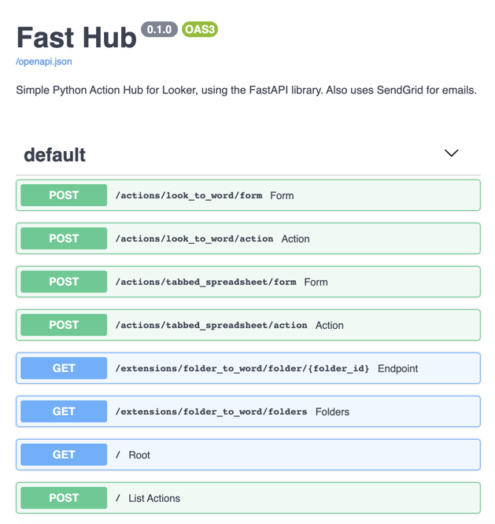

# fast-hub
Simple Looker Action Hub using Python + FastAPI. Includes SendGrid for emails.

# To use
Requites Python 3.6+. I haven't tested this for deployment yet. This might work for you, too:

1. `python3 -m venv .venv`
2. `source .venv/bin/activate`
3. `pip install -r requirements.txt`
4. `./start`

# FastAPI – Automatic OpenAPI documentation

